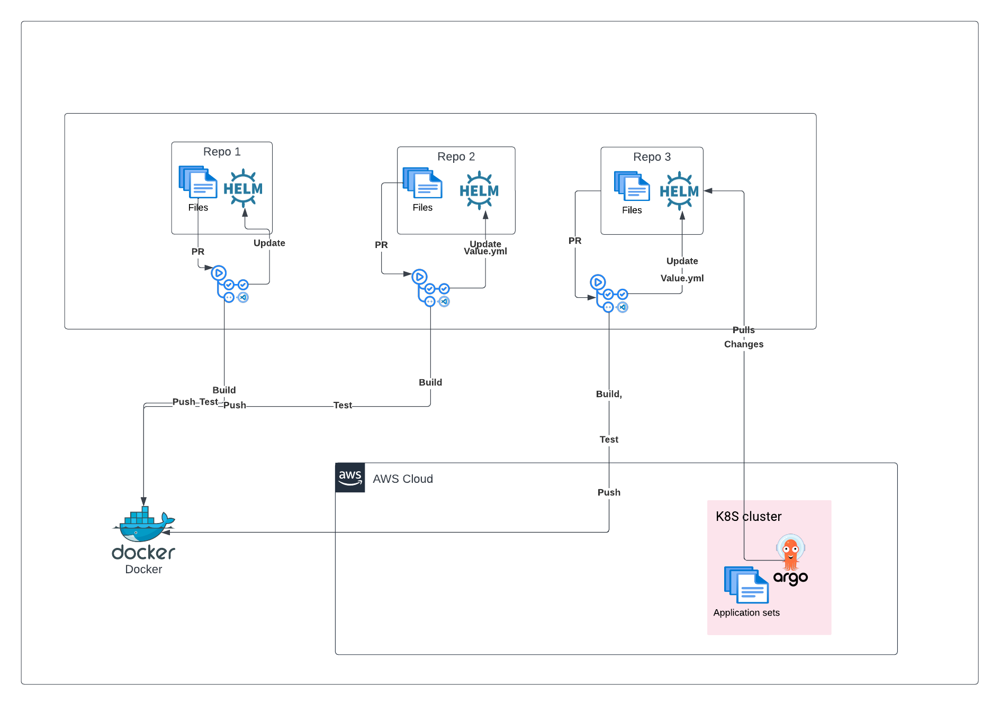

# Design and Architecting of an On-demand Temporary Test Environment with Kubernetes and Argo CD

## Project Overview:

This repo holds the terraform and other config for building the EKS cluster On AWS for the On-demand TestBed Project on Kubernetes 

## Summary:

This project aimed to design and implement an on-demand testing environment utilizing Kubernetes and Argo CD. By leveraging Argo CD's capabilities, the project aimed to create temporary testing environments (namespaces) on Kubernetes automatically triggered whenever a pull request (PR) was made to any tracked repositories. This approach significantly reduced the time required to receive feedback on application failures, enhancing the overall efficiency of the development process.

## Project Objectives:

- Design and implement an on-demand testing environment infrastructure on Kubernetes.
- Utilize Argo CD for automated creation and management of temporary testing environments.
- Integrate GitHub Actions for continuous integration (CI) workflows.
- Implement monitoring and visualization using Prometheus and Grafana.
- Automate infrastructure provisioning on AWS EKS using Terraform.

## Technologies and Tools Used:

- AWS EKS (Elastic Kubernetes Service) for container orchestration.
- Argo CD for continuous delivery (CD) and application management.
- Node.js and Vue.js HTML for the front end of the test web application.
- Terraform for provisioning EKS clusters, node groups, networking stack, and other essential resources on AWS.
- GitHub Actions for CI workflows.
- Docker for containerization of application code.
- Prometheus for ingesting logs and metrics data from EKS clusters.
- Grafana for data visualization and monitoring.
- Visual Studio Code (VSCode) for coding Terraform configuration files.

## Project Implementation:

### Infrastructure Setup with AWS EKS and Terraform:

- Provisioned EKS clusters, node groups, and networking stack using Terraform.
- Configured AWS resources to support containerized applications.

### Implementation of On-demand Testing Environment with Argo CD:

- Integrated Argo CD for automated deployment and management of applications on Kubernetes.
- Utilized Argo CD's ApplicationSets feature to create namespaces for temporary testing environments triggered by PRs dynamically.

### Continuous Integration with GitHub Actions:

- Configured GitHub Actions for CI workflows to automate the testing and building of application code.
- Integrated GitHub Actions with Argo CD for seamless deployment of changes to Kubernetes clusters.

### Containerization and Deployment:

- Containerized application code using Docker for consistency and portability.
- Implemented automated deployment pipelines to deploy containerized applications to Kubernetes clusters.

### Monitoring and Visualization:

- Set up Prometheus to ingest logs and metrics data from EKS clusters.
- Implemented Grafana dashboards for real-time monitoring and visualization of cluster resource utilization and application performance.

## Project Outcomes:

- **Reduced Feedback Time:** Implementing on-demand testing environments reduced the time required to receive feedback on application failures, enabling faster iteration and development cycles.
- **Improved Efficiency:** Automation of infrastructure provisioning, deployment, and monitoring improved the overall efficiency of the development process, reducing manual intervention and potential errors.
- **Enhanced Collaboration:** Seamless integration with GitHub Actions and Argo CD facilitated better collaboration between development and operations teams, streamlining the deployment process.
- **Scalability and Flexibility:** The infrastructure built on AWS EKS and managed with Terraform provided scalability and flexibility to accommodate future growth and changes in workload demands.

## Conclusion:

The project successfully achieved its objectives of designing and implementing an on-demand testing environment using Kubernetes and Argo CD. By automating the creation of temporary testing environments triggered by pull requests, the project significantly reduced feedback time and improved the efficiency of the development process. The use of modern DevOps tools and practices such as GitHub Actions, Docker, Terraform, Prometheus, and Grafana contributed to the project's success, enabling seamless integration, deployment, and monitoring of applications. Overall, the project demonstrated the effectiveness of leveraging cloud-native technologies and automation for enhancing software development workflows.

<!-- BEGIN_TF_DOCS -->
## Terraform docs 

| Name | Version |
|------|---------|
|  [terraform](#requirement\_terraform) | >= 1.0 |
|  [aws](#requirement\_aws) | ~> 4.46 |

## Providers

| Name | Version |
|------|---------|
|  [aws](#provider\_aws) | ~> 4.46 |

## Modules

No modules.

## Resources

| Name | Type |
|------|------|
| [aws_eip.nat](https://registry.terraform.io/providers/hashicorp/aws/latest/docs/resources/eip) | resource |
| [aws_eks_cluster.demo](https://registry.terraform.io/providers/hashicorp/aws/latest/docs/resources/eks_cluster) | resource |
| [aws_eks_node_group.private_nodes](https://registry.terraform.io/providers/hashicorp/aws/latest/docs/resources/eks_node_group) | resource |
| [aws_iam_role.demo](https://registry.terraform.io/providers/hashicorp/aws/latest/docs/resources/iam_role) | resource |
| [aws_iam_role.nodes](https://registry.terraform.io/providers/hashicorp/aws/latest/docs/resources/iam_role) | resource |
| [aws_iam_role_policy_attachment.amazon_ssm_managed_instance_core](https://registry.terraform.io/providers/hashicorp/aws/latest/docs/resources/iam_role_policy_attachment) | resource |
| [aws_iam_role_policy_attachment.demo_amazon_eks_cluster_policy](https://registry.terraform.io/providers/hashicorp/aws/latest/docs/resources/iam_role_policy_attachment) | resource |
| [aws_iam_role_policy_attachment.nodes_amazon_ec2_container_registry_read_only](https://registry.terraform.io/providers/hashicorp/aws/latest/docs/resources/iam_role_policy_attachment) | resource |
| [aws_iam_role_policy_attachment.nodes_amazon_eks_cni_policy](https://registry.terraform.io/providers/hashicorp/aws/latest/docs/resources/iam_role_policy_attachment) | resource |
| [aws_iam_role_policy_attachment.nodes_amazon_eks_worker_node_policy](https://registry.terraform.io/providers/hashicorp/aws/latest/docs/resources/iam_role_policy_attachment) | resource |
| [aws_internet_gateway.igw](https://registry.terraform.io/providers/hashicorp/aws/latest/docs/resources/internet_gateway) | resource |
| [aws_nat_gateway.nat](https://registry.terraform.io/providers/hashicorp/aws/latest/docs/resources/nat_gateway) | resource |
| [aws_route_table.private](https://registry.terraform.io/providers/hashicorp/aws/latest/docs/resources/route_table) | resource |
| [aws_route_table.public](https://registry.terraform.io/providers/hashicorp/aws/latest/docs/resources/route_table) | resource |
| [aws_route_table_association.private_us_east_1a](https://registry.terraform.io/providers/hashicorp/aws/latest/docs/resources/route_table_association) | resource |
| [aws_route_table_association.private_us_east_1b](https://registry.terraform.io/providers/hashicorp/aws/latest/docs/resources/route_table_association) | resource |
| [aws_route_table_association.public_us_east_1a](https://registry.terraform.io/providers/hashicorp/aws/latest/docs/resources/route_table_association) | resource |
| [aws_route_table_association.public_us_east_1b](https://registry.terraform.io/providers/hashicorp/aws/latest/docs/resources/route_table_association) | resource |
| [aws_subnet.private_us_east_1a](https://registry.terraform.io/providers/hashicorp/aws/latest/docs/resources/subnet) | resource |
| [aws_subnet.private_us_east_1b](https://registry.terraform.io/providers/hashicorp/aws/latest/docs/resources/subnet) | resource |
| [aws_subnet.public_us_east_1a](https://registry.terraform.io/providers/hashicorp/aws/latest/docs/resources/subnet) | resource |
| [aws_subnet.public_us_east_1b](https://registry.terraform.io/providers/hashicorp/aws/latest/docs/resources/subnet) | resource |
| [aws_vpc.eks_vpc](https://registry.terraform.io/providers/hashicorp/aws/latest/docs/resources/vpc) | resource |

## Inputs

No inputs.

## Outputs

No outputs.
<!-- END_TF_DOCS -->
